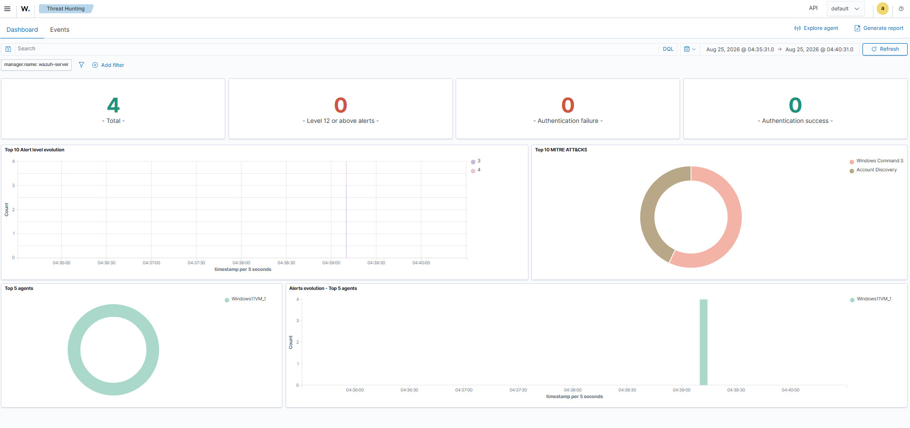
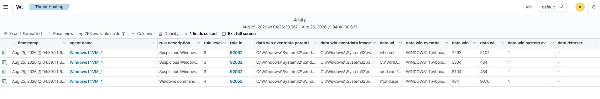
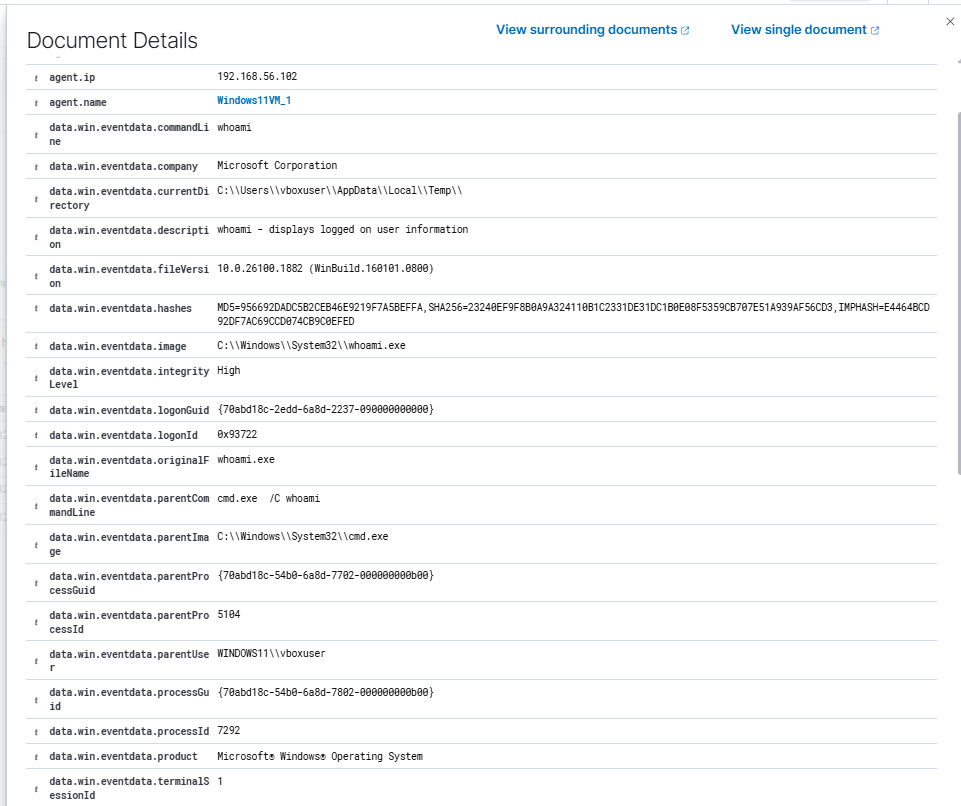

# T1033 — System Owner/User Discovery

**Tactic:** Discovery  
**Date tested:** 08/25/2026  
**Test executed:** Atomic Red Team T1033, Test 1

---

## Lab environment

| Component | Detail |
|---|---|
| SIEM | Wazuh 4.14.7 OVA appliance, 192.168.56.101 |
| Monitored endpoint | Windows 11 (evaluation), 192.168.56.102 |
| Endpoint telemetry | Sysmon with SwiftOnSecurity config |
| Agent | Wazuh agent, reporting on 1514/tcp |
| Network | VirtualBox Host-only, 192.168.56.0/24, no internet egress |

The Windows VM is both the simulated victim and the point of execution — this
test models an attacker who already has a foothold, not initial access.

The Windows host runs a 90-day evaluation licence. It expires in late November
2026, at which point the VM is rebuilt rather than renewed.

---

## What the technique is

Once an attacker has code execution on a host, one of the first things they
need to know is *whose* account they're running as and what it can do. That
determines whether they escalate, move laterally, or start collecting data.
T1033 covers the commands used to answer that question.

Individually these commands are indistinguishable from routine administration,
which is what makes the technique a useful first detection exercise.

---

## Execution

```powershell
Invoke-AtomicTest T1033 -TestNumbers 1
```

The test attempts several enumeration commands in sequence.

**Result: partial success, exit code 1.**

| Command | Outcome |
|---|---|
| whoami | Succeeded — returned windows11\vboxuser |
| wmic | Not recognized — binary absent |
| quser | Not recognized — binary absent |
| qwinsta | Not recognized — binary absent |

---

### Why three of four commands failed

Microsoft has deprecated wmic, and it is absent from current Windows 11 builds.
quser and qwinsta are Remote Desktop Services utilities that ship with
Windows Server but not with all desktop editions.

**Implication:** a detection rule written to match on `wmic` command lines
would find nothing on this host — not because the technique isn't being used,
but because the tooling moved. The same enumeration is now typically performed
through PowerShell CIM cmdlets, which produce entirely different command-line
strings. Detections tied to specific binaries decay as the platform changes.

---

## What I predicted

Nothing — this was my first Atomic Red Team test and I had no basis for
forming an expectation. Recording a prediction before execution is a practice
I'm adopting from T1082 onward, since comparing expected against observed is
what makes an unexpected result visible rather than just unremarkable.

---

## What the telemetry showed

**Alerted processes (Sysmon Event ID 1)**

These are the four process-creation events that matched a Wazuh rule. Sysmon
collected additional Event ID 1 records during this window that matched no rule
and therefore do not appear here.

All processes ran as WINDOWS11\vboxuser. All images are in C:\Windows\System32\
unless noted.

| image | parentImage | commandLine | processId / parentProcessId |
|---|---|---|---|
| whoami.exe | cmd.exe | whoami | 7292 / 5104 |
| cmd.exe | cmd.exe | cmd.exe /c qwinsta /server:localhost \| findstr "Active Disc" | 3304 / 484 |
| cmd.exe | cmd.exe | cmd.exe /C whoami | 5104 / 484 |
| cmd.exe | powershell.exe | cmd.exe /c cmd.exe /C whoami & wmic useraccount... (full below) | 484 / 9076 |

**Process tree**

Reconstructed from the alerted events above. Processes that ran without matching
a rule are not represented.

```
powershell.exe (9076)          — session Atomic Red Team ran from
└─ cmd.exe (484)               — outer chained command
   ├─ cmd.exe (3304)           — qwinsta | findstr branch
   └─ cmd.exe (5104)
      └─ whoami.exe (7292)     — the only discovery binary that executed
```

**Full command line as observed in Sysmon:**

```
"cmd.exe" /c cmd.exe /C whoami & wmic useraccount get /ALL & quser /SERVER:"localhost" & quser & qwinsta.exe /server:localhost & qwinsta.exe & for /F "tokens=1,2" %i in ('qwinsta /server:localhost ^| findstr "Active Disc"') do @echo %i | find /v "#" | find /v "console" || echo %j > computers.txt & @FOR /F %n in (computers.txt) DO @FOR /F "tokens=1,2" %i in ('qwinsta /server:%n ^| findstr "Active Disc"') do @echo %i | find /v "#" | find /v "console" || echo %j > usernames.txt
```

Command line shown unescaped; the Wazuh dashboard renders `&` as `&amp;` and
`>` as `&gt;`.

---

### Alerts raised (Wazuh)

| Rule ID | Level | Description | ATT&CK tactic | ATT&CK technique | Count |
|---|---|---|---|---|---|
| 92032 | 3 | Suspicious Windows cmd shell execution | Discovery, Execution | T1087 Account Discovery, T1059.003 Windows Command Shell | 3 |
| 92052 | 4 | Windows command prompt started by an abnormal process | Execution | T1059.003 Windows Command Shell | 1 |

Both rules are defined in the manager's ruleset file 0800-Sysmon_id_1.xml.

Dashboard overview for the test window. The MITRE ATT&CK panel is what first
surfaced the Discovery tagging described in the analysis below — the alerts table
alone shows only the rule descriptions:





Expanded view of the `whoami.exe` process-creation event, showing the full
untruncated field values quoted in the table above:



**Also visible in that event, and worth noting:**

- `integrityLevel: High` — the process ran elevated. Discovery performed with
  administrative privileges is more consequential than the same command run as a
  standard user, since it implies the account is already privileged. Integrity
  level is another axis a detection could use, and one that costs nothing to add.
- `processGuid` and `parentProcessGuid` — unique per process, unlike PIDs, which
  Windows reuses. These are the reliable way to link parent to child.
  
---

### Open question: are failed executions logged?

Three of the four commands referenced binaries that don't exist on this host.
Did Sysmon record anything for them?

**Method.** Searched Event ID 1 records for each binary name, then checked the
Image field on every match rather than trusting the text hit.

**Result**

| Search term | Matches | Image on matches | Process actually created? |
|---|---|---|---|
| whoami | 3 + 3 | whoami.exe and cmd.exe | Yes |
| wmic | 3 | cmd.exe only | No |
| quser | 3 | cmd.exe only | No |
| qwinsta | 3 | cmd.exe only | No |

**Answer.** Sysmon does not create Event ID 1 records for binaries that fail to
execute — no process is created, so there is nothing to log. The attempted binary
names do persist in the commandLine field of the parent process that tried to invoke
them, which is why text searches returned hits.

---

## Analysis

**1. Text matching conflates "executed" with "referenced"**

Searching the Sysmon log for wmic returned three hits, which looked like evidence
that wmic had run. It hadn't. All three were cmd.exe events that happened to contain
the string "wmic" inside their command line — the search matched against the full
event text, and the command line is part of that text.

Only the Image field distinguishes the two cases. Checking it showed whoami.exe as a
real image value and the other three names appearing nowhere except inside a command
line.

This is a straightforward route to a wrong conclusion that looks well-evidenced: the
query returns hits, the hits are genuine events, and the interpretation is still
incorrect. The habit that prevents it is confirming the field, not the match.

**2. The rule descriptions and the ATT&CK metadata say different things**

Four alerts were raised — three at level 3 (rule 92032, "suspicious Windows cmd
shell execution") and one at level 4 (rule 92052, "Windows command prompt
started by an abnormal process").

Read only the descriptions and the conclusion is that the SIEM caught the
delivery mechanism and missed the technique: both rules describe shell execution
and process ancestry, neither mentions enumeration.

The ATT&CK metadata tells a different story:

| Alerts | rule.mitre.id | Tactic | Technique |
|---|---|---|---|
| 3 | T1087, T1059.003 | Discovery, Execution | Account Discovery, Windows Command Shell |
| 1 | T1059.003 | Execution | Windows Command Shell |

Three of the four alerts are tagged with a Discovery tactic. So the ruleset did
associate this activity with discovery — that association simply isn't visible in
the alert text an analyst reads first.

**Two things follow.**

The tagging is close but not exact. T1087 is Account Discovery — enumerating
accounts on a system. The technique executed was T1033, System Owner/User
Discovery — identifying the current user. Neighbouring techniques, and the
mapping is defensible given the command line enumerates user accounts, but it is
not the technique that ran. A dashboard filtered by ATT&CK ID would not surface
this test under T1033.

More practically: the description field and the metadata are different surfaces
with different content, and an analyst triaging by description alone would form a
different impression than one filtering by tactic. That gap between what a rule
is *named* and what it is *tagged* is worth knowing about before relying on
either.

**What I got wrong initially.** My first reading of these results was that no
alert identified the activity as discovery. That was based on the rule
descriptions, which is what the events table shows by default. Expanding the
alerts and reading `rule.mitre.tactic` contradicted it. The correction came from
noticing "Account Discovery" in a summary chart and checking the underlying
field, rather than from the alert list I had been working from.

Alert levels were 3 and 4 — informational. In production these would not page
anyone, which is probably the right call given how noisy the alternative would
be.

---

## Would I detect on this?

Not on whoami execution alone. Administrators, login scripts, and software
installers run it constantly. A rule matching on it would generate false
positives indefinitely and be tuned out within a week.

But the observed command line is highly detectable. It chains eight discovery
commands with &, redirects output to computers.txt and usernames.txt, and nests
a loop enumerating sessions on remote hosts. No administrator types this interactively.

**Candidate detections**

**1. Multiple discovery binaries in a single command line.** The signature here is
composition, not individual tool. Likely low false-positive rate.

**2. Discovery commands with output redirection to a file.** Staging results for later
collection is attacker behavior, not troubleshooting behavior.

**3. Anomalous parent process.** whoami.exe under a web server or database process
is meaningfully different from whoami.exe under an interactive shell.

**4. Enumeration clustering.** Several distinct discovery techniques within a short window,
correlated across events rather than matched in a single rule.

**Where each would produce false positives**

**1. Multiple discovery binaries in one command line.** Software installers and setup scripts
routinely chain enumeration commands to check the environment before installing. Asset inventory
and endpoint management agents do the same on a schedule, by design. Vulnerability scanners run
discovery as their whole purpose. In an enterprise this rule would fire constantly on management
tooling unless those parent processes were excluded — and maintaining that exclusion list is
ongoing work, not a one-time tuning pass.

**2. Discovery output redirected to a file.** IT scripts write inventory to files all the time:
audit reporting, license reconciliation, troubleshooting data collection, onboarding checks. The
behavior is identical to staging for exfiltration; only intent differs, and intent isn't in the log.
Narrowing to unusual output locations (temp directories, user profile roots) would cut the noise but
also miss an attacker who writes somewhere ordinary.

**3. Anomalous parent process.** This one depends entirely on having a baseline, and "anomalous" means
different things per environment. Legitimate applications shell out — monitoring agents, remote management tools,
build systems, and some line-of-business software all spawn shells as designed. Without knowing what's
normal for a given host, the rule is either too broad or arbitrary. Worth noting that this is precisely
the rule that fired on my own test harness rather than on the technique.

**4. Enumeration clustering.** New machine provisioning, IT audits, and vulnerability scans all produce
dense bursts of discovery activity. So does an administrator actively troubleshooting a problem — they
run many discovery commands quickly, which is exactly the pattern being matched. Time-of-day or account-based
context would help but wouldn't eliminate it.

**Limitation of this lab for answering the question.** All of the above is reasoned rather than measured.
This environment has one monitored host, no user population, and no normal business activity, so there's no
baseline to test false-positive rates against. Assessing these rules properly would require running them against
real traffic over time — which is the part of detection engineering a home lab can't reproduce.

---

## What I'd do differently next time

**Run one test at a time.** Did this, and it was the right call — every event traced unambiguously back to
a single command.

**Check the Image field before drawing any conclusion from a text search.** Three of my four apparent findings
dissolved on inspection.

**Record the exact log channel name and query up front.** Time was lost to a mistyped channel name that produced
a "log does not exist" error, which looked like a broken Sysmon install rather than a typo.

**Note the start time before executing.** Reconstructing which events belonged to the test meant searching a
wider window than necessary.

**Use processGuid, not just PIDs.** PIDs are reused by Windows once a process exits, so they can't reliably identify
a process on their own. I transcribed the PID/PPID columns transposed at one point and the tree didn't close — GUIDs would
have made the error obvious immediately. Sysmon was recording processGuid and parentProcessGuid all along; I simply wasn't
reading expanded events yet, so I never saw them.

**Read the SwiftOnSecurity config before relying on the telemetry.** It deliberately excludes activity to control volume.
Knowing what's filtered is part of knowing what "no events" means.

---

## Open questions

Does Wazuh's default ruleset contain a rule whose detection *logic* targets discovery behavior, rather than a
shell-execution rule that carries a Discovery tag? Three of the four alerts here are tagged T1087, but the rules
themselves match on cmd.exe ancestry — they would fire identically on anything spawned that way, discovery or not.
The tag describes what the activity was; it isn't what the rule looked for. I haven't reviewed the ruleset to see
whether a genuinely behavior-based discovery rule exists.

Would my own monitoring detect tampering with the agent's configuration? During setup I edited
C:\Program Files (x86)\ossec-agent\ossec.conf several times, and several attempts failed silently on permissions.
I never checked whether any of it was recorded. This matters beyond the setup annoyance: modifying or disabling an agent
config is a standard defense-evasion move (T1562), and anyone who can write to that file can blind the SIEM. Does the SwiftOnSecurity
config generate Event ID 11 or 23 for that path? Does Wazuh's file integrity monitoring cover its own installation directory by default?
Untested.

What would this technique look like executed through PowerShell CIM cmdlets instead of the deprecated wmic? That's the modern equivalent,
and it would produce entirely different telemetry — likely the more realistic test.

Would a command-line-based detection survive simple obfuscation (variable substitution, string concatenation, encoded commands)? Untested.

---

## Credits

- [Atomic Red Team](https://github.com/redcanaryco/atomic-red-team) by Red Canary — attack simulation tests
- [sysmon-config](https://github.com/SwiftOnSecurity/sysmon-config) by SwiftOnSecurity — Sysmon configuration
- [MITRE ATT&CK](https://attack.mitre.org/) — technique taxonomy
