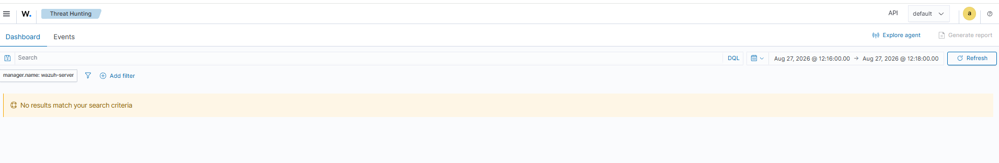
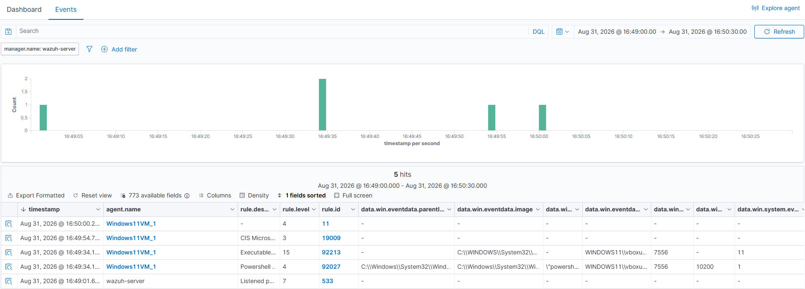
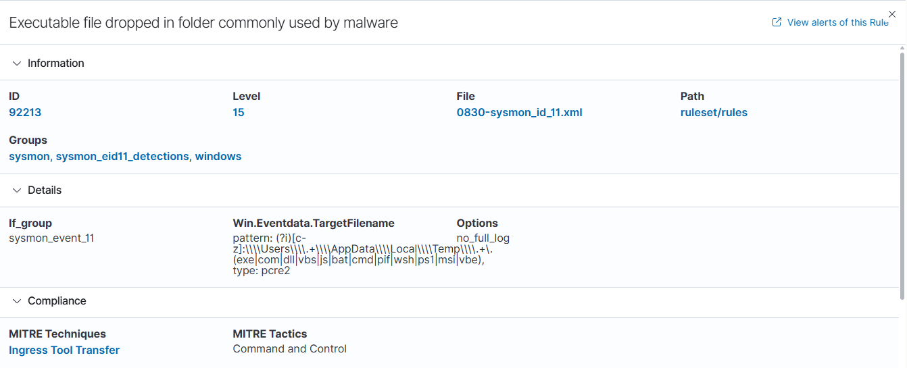
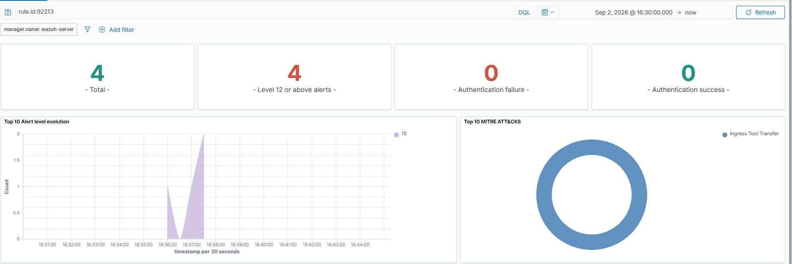

# T1033 — System Owner/User Discovery

**Tactic:** Discovery  
**Dates tested:** 25 Aug, 27 Aug, 31 Aug 2026  
**Tests executed:** Atomic Red Team T1033 — tests 1, 5 and 6

---

## Lab environment

| Component | Detail |
|---|---|
| SIEM | Wazuh 4.14.7 OVA appliance, 192.168.56.101 |
| Monitored endpoint | Windows 11 (evaluation), 192.168.56.102 |
| Endpoint telemetry | Sysmon with SwiftOnSecurity config |
| Agent | Wazuh agent, reporting on 1514/tcp |
| Network | VirtualBox Host-only, 192.168.56.0/24, no internet egress |

The Windows VM is both the simulated victim and the point of execution — this
test models an attacker who already has a foothold, not initial access.

The Windows host runs a 90-day evaluation licence. It expires in late November
2026, at which point the VM is rebuilt rather than renewed.

---

## What the technique is

Once an attacker has code execution on a host, one of the first things they
need to know is *whose* account they're running as and what it can do. That
determines whether they escalate, move laterally, or start collecting data.
T1033 covers the commands used to answer that question.

Individually these commands are indistinguishable from routine administration,
which is what makes the technique a useful first detection exercise.

---

## Test 1 — System Owner/User Discovery (command prompt)

**Executed:** 25 Aug 2026

```powershell
Invoke-AtomicTest T1033 -TestNumbers 1
```

The test attempts several enumeration commands in sequence.

**Result: partial success, exit code 1.**

| Command | Outcome |
|---|---|
| whoami | Succeeded — returned windows11\vboxuser |
| wmic | Not recognized — binary absent |
| quser | Not recognized — binary absent |
| qwinsta | Not recognized — binary absent |

---

### Why three of four commands failed

Microsoft has deprecated wmic, and it is absent from current Windows 11 builds.
quser and qwinsta are Remote Desktop Services utilities that ship with
Windows Server but not with all desktop editions.

**Implication:** a detection rule written to match on `wmic` command lines
would find nothing on this host — not because the technique isn't being used,
but because the tooling moved. The same enumeration is now typically performed
through PowerShell CIM cmdlets, which produce entirely different command-line
strings. Detections tied to specific binaries decay as the platform changes.

---

## What I predicted

Nothing — this was my first Atomic Red Team test and I had no basis for
forming an expectation. Recording a prediction before execution is a practice
I'm adopting from T1082 onward, since comparing expected against observed is
what makes an unexpected result visible rather than just unremarkable.

---

## What the telemetry showed

**Alerted processes (Sysmon Event ID 1)**

These are the four process-creation events that matched a Wazuh rule. Sysmon
collected additional Event ID 1 records during this window that matched no rule
and therefore do not appear here.

All processes ran as WINDOWS11\vboxuser. All images are in C:\Windows\System32\
unless noted.

| image | parentImage | commandLine | processId / parentProcessId |
|---|---|---|---|
| whoami.exe | cmd.exe | whoami | 7292 / 5104 |
| cmd.exe | cmd.exe | cmd.exe /c qwinsta /server:localhost \| findstr "Active Disc" | 3304 / 484 |
| cmd.exe | cmd.exe | cmd.exe /C whoami | 5104 / 484 |
| cmd.exe | powershell.exe | cmd.exe /c cmd.exe /C whoami & wmic useraccount... (full below) | 484 / 9076 |

**Process tree**

Reconstructed from the alerted events above. Processes that ran without matching
a rule are not represented.

```
powershell.exe (9076)          — session Atomic Red Team ran from
└─ cmd.exe (484)               — outer chained command
   ├─ cmd.exe (3304)           — qwinsta | findstr branch
   └─ cmd.exe (5104)
      └─ whoami.exe (7292)     — the only discovery binary that executed
```

**Full command line as observed in Sysmon:**

```
"cmd.exe" /c cmd.exe /C whoami & wmic useraccount get /ALL & quser /SERVER:"localhost" & quser & qwinsta.exe /server:localhost & qwinsta.exe & for /F "tokens=1,2" %i in ('qwinsta /server:localhost ^| findstr "Active Disc"') do @echo %i | find /v "#" | find /v "console" || echo %j > computers.txt & @FOR /F %n in (computers.txt) DO @FOR /F "tokens=1,2" %i in ('qwinsta /server:%n ^| findstr "Active Disc"') do @echo %i | find /v "#" | find /v "console" || echo %j > usernames.txt
```

Command line shown unescaped; the Wazuh dashboard renders `&` as `&amp;` and
`>` as `&gt;`.

---

### Alerts raised (Wazuh)

| Rule ID | Level | Description | ATT&CK tactic | ATT&CK technique | Count |
|---|---|---|---|---|---|
| 92032 | 3 | Suspicious Windows cmd shell execution | Discovery, Execution | T1087 Account Discovery, T1059.003 Windows Command Shell | 3 |
| 92052 | 4 | Windows command prompt started by an abnormal process | Execution | T1059.003 Windows Command Shell | 1 |

Both rules are defined in the manager's ruleset file 0800-Sysmon_id_1.xml.

Dashboard overview for the test window. The MITRE ATT&CK panel is what first
surfaced the Discovery tagging described in the analysis below — the alerts table
alone shows only the rule descriptions:


Expanded view of the `whoami.exe` process-creation event, showing the full
untruncated field values quoted in the table above:


**Also visible in that event, and worth noting:**

- `integrityLevel: High` — the process ran elevated. Discovery performed with
  administrative privileges is more consequential than the same command run as a
  standard user, since it implies the account is already privileged. Integrity
  level is another axis a detection could use, and one that costs nothing to add.
- `processGuid` and `parentProcessGuid` — unique per process, unlike PIDs, which
  Windows reuses. These are the reliable way to link parent to child.
- `hashes` (MD5, SHA256, IMPHASH) — not useful for a signed system binary like
  `whoami.exe`, but this is the field that would matter for an unknown executable
  being checked against threat intelligence.

---

### Open question: are failed executions logged?

Three of the four commands referenced binaries that don't exist on this host.
Did Sysmon record anything for them?

**Method.** Searched Event ID 1 records for each binary name, then checked the
Image field on every match rather than trusting the text hit.

**Result**

| Search term | Matches | Image on matches | Process actually created? |
|---|---|---|---|
| whoami | 3 + 3 | whoami.exe and cmd.exe | Yes |
| wmic | 3 | cmd.exe only | No |
| quser | 3 | cmd.exe only | No |
| qwinsta | 3 | cmd.exe only | No |

**Answer.** Sysmon does not create Event ID 1 records for binaries that fail to
execute — no process is created, so there is nothing to log. The attempted binary
names do persist in the commandLine field of the parent process that tried to invoke
them, which is why text searches returned hits.

---

## Analysis

**1. Text matching conflates "executed" with "referenced"**

Searching the Sysmon log for wmic returned three hits, which looked like evidence
that wmic had run. It hadn't. All three were cmd.exe events that happened to contain
the string "wmic" inside their command line — the search matched against the full
event text, and the command line is part of that text.

Only the Image field distinguishes the two cases. Checking it showed whoami.exe as a
real image value and the other three names appearing nowhere except inside a command
line.

This is a straightforward route to a wrong conclusion that looks well-evidenced: the
query returns hits, the hits are genuine events, and the interpretation is still
incorrect. The habit that prevents it is confirming the field, not the match.

**2. The rule descriptions and the ATT&CK metadata say different things**

Four alerts were raised — three at level 3 (rule 92032, "suspicious Windows cmd
shell execution") and one at level 4 (rule 92052, "Windows command prompt
started by an abnormal process").

Read only the descriptions and the conclusion is that the SIEM caught the
delivery mechanism and missed the technique: both rules describe shell execution
and process ancestry, neither mentions enumeration.

The ATT&CK metadata tells a different story:

| Alerts | rule.mitre.id | Tactic | Technique |
|---|---|---|---|
| 3 | T1087, T1059.003 | Discovery, Execution | Account Discovery, Windows Command Shell |
| 1 | T1059.003 | Execution | Windows Command Shell |

Three of the four alerts are tagged with a Discovery tactic. So the ruleset did
associate this activity with discovery — that association simply isn't visible in
the alert text an analyst reads first.

**Two things follow.**

The tagging is close but not exact. T1087 is Account Discovery — enumerating
accounts on a system. The technique executed was T1033, System Owner/User
Discovery — identifying the current user. Neighbouring techniques, and the
mapping is defensible given the command line enumerates user accounts, but it is
not the technique that ran. A dashboard filtered by ATT&CK ID would not surface
this test under T1033.

More practically: the description field and the metadata are different surfaces
with different content, and an analyst triaging by description alone would form a
different impression than one filtering by tactic. That gap between what a rule
is *named* and what it is *tagged* is worth knowing about before relying on
either.

**What I got wrong initially.** My first reading of these results was that no
alert identified the activity as discovery. That was based on the rule
descriptions, which is what the events table shows by default. Expanding the
alerts and reading `rule.mitre.tactic` contradicted it. The correction came from
noticing "Account Discovery" in a summary chart and checking the underlying
field, rather than from the alert list I had been working from.

Alert levels were 3 and 4 — informational. In production these would not page
anyone, which is probably the right call given how noisy the alternative would
be.

---

## Test 5 — GetCurrent with PowerShell Script

**Executed:** 27 Aug 2026, 12:16:21

```powershell
Invoke-AtomicTest T1033 -TestNumbers 5
```

The technique here is a single .NET call inside PowerShell:

```powershell
[System.Security.Principal.WindowsIdentity]::GetCurrent() | Out-File -FilePath .\CurrentUserObject.txt
```

**Prediction (recorded before execution):** an Event ID 1 alert, because the
technique uses the Windows identity to call `GetCurrent()`, plus unauthorized
access to a file to steal data.

**Result: exit code 0, no console output.** The output file was written — not to
the working directory as the command implies, but to `%TEMP%`.

### Telemetry

One process-creation event corresponds to this test:

| image | parentImage | commandLine |
|---|---|---|
| `powershell.exe` | `powershell.exe` | `"powershell.exe" & {[System.Security.Principal.WindowsIdentity]::GetCurrent() \| Out-File -FilePath .\CurrentUserObject.txt}` |

**No child process was created.** The .NET call executes inside the already-running
PowerShell process. There is no `whoami.exe`, no `cmd.exe`, nothing for a
process-name rule to match on. The entire technique exists only as text inside one
command line.

Also present in the window, and *not* part of the technique: `whoami.exe` and
`HOSTNAME.EXE` with bare command lines and no arguments, both parented by
PowerShell. These are Atomic Red Team's own instrumentation collecting host
context. A `whoami.exe` sitting next to a discovery test is exactly the kind of
thing that invites misattribution.

### Alerts

**Zero.** Nothing in the Dashboard view, and nothing in the Events view either.



**Prediction outcome: wrong.** Sysmon did record a process creation, so the
direction was half right — but nothing alerted, and there was no unauthorized
access. The file was written by my own user to my own temp directory.

### The finding underneath the zero

Zero *events* — not just zero alerts — was unexpected, since Sysmon had clearly
logged the process locally. Checked the manager configuration:

```bash
sudo grep -A3 "logall" /var/ossec/etc/ossec.conf
```

```
<logall>no</logall>
<logall_json>no</logall_json>
```

And `/var/ossec/logs/archives/archives.log` is 0 bytes. Nothing has ever been
archived.

**This Wazuh install retains only events that match a rule.** Everything else is
evaluated and discarded at the manager. The "Events" view reads the alerts index;
there is no raw event store behind it.

So detection and retention are the same thing in this configuration. If I learned
tomorrow that this technique had run, I could not go back and look — the record
does not exist. That is a defensible default (archiving everything is expensive)
but it is a choice, and worth knowing you have made it. See also the build notes.

---

## Test 6 — SocGholish whoami

**Executed:** 31 Aug 2026, 16:49

```powershell
Invoke-AtomicTest T1033 -TestNumbers 6
```

This test models a real malware family. SocGholish is a JavaScript-based loader
distributed through fake browser-update prompts on compromised websites; operators
use it to establish a foothold before handing off to other crews. The discovery
step simulated here is what happens immediately after initial access — deciding
whether the host is worth escalating on.

The test generates a random filename, then redirects `whoami.exe /all` into it:

```powershell
$rad = (Get-Random -Count 5 -InputObject $StringSet) -join ''
$file = "rad" + $rad + ".tmp"
whoami.exe /all >> $env:temp\$file
```

**Prediction (recorded before execution):** an Event ID 1 alert from `whoami.exe`,
which would then have to execute `cmd.exe` to operate, leaving familiar
parent/child PID relationships. No expectation formed about SocGholish itself.

**Result:** `radS4RM3.tmp` created in `%TEMP%`, 11,268 bytes — a full `whoami /all`
dump.

### Telemetry

Two process-creation events belong to this test, both at 16:49:35:

| image | parentImage | commandLine |
|---|---|---|
| `powershell.exe` | `powershell.exe` | the full SocGholish script, inline |
| `whoami.exe` | `powershell.exe` | `"C:\WINDOWS\system32\whoami.exe" /all` |

**Prediction outcome: half right.** `whoami.exe` appeared with an Event ID 1, as
expected. But there is **no `cmd.exe` anywhere** — PowerShell spawned `whoami.exe`
directly. That matters, because test 1's alerts fired on cmd-under-cmd ancestry,
and that ancestry does not exist here.

Harness noise in the same window: `HOSTNAME.EXE` at 16:49:22 and 16:49:23, and a
`whoami.exe` at 16:49:33 — all bare command lines with no arguments. The
technique's `whoami.exe` is distinguishable only by its `/all` argument. Without
checking the command line there would be two `whoami.exe` executions and no way to
tell which was the test.

### File creation

Only **one** Event ID 11 in the window:

| Image | TargetFilename |
|---|---|
| `powershell.exe` | `C:\Users\vboxuser\AppData\Local\Temp\__PSScriptPolicyTest_t4faxv5h.mj0.ps1` |

`radS4RM3.tmp` — the artifact the technique actually produced, containing a full
credential context dump — **was never logged**.

The SwiftOnSecurity config uses `<FileCreate onmatch="include">`, so Event ID 11
fires only for paths on its list: `\Start Menu`, `\Startup\`, `\Downloads\`, and a
set of extensions (`.bat`, `.cmd`, `.hta`, `.doc`, `.xls`, `.rtf`, `.ps1`, and
others). Neither `.tmp` nor temp directories appear anywhere on it.

This is not an exclusion filtering the file out. The file was never in scope. The
config's design principle for file creation is "log the file types attackers use to
gain execution" — and a `.tmp` holding stolen output is not an execution vector, so
it falls outside the design entirely.

### Alerts

Two alerts attributable to this test, both at 16:49:34:

| Rule | Level | Description | ATT&CK technique | ATT&CK tactic |
|---|---|---|---|---|
| 92213 | **15** | Executable file dropped in folder commonly used by malware | Ingress Tool Transfer | Command and Control |
| 92027 | 4 | Powershell process spawned powershell instance | PowerShell | Execution |

Three other alerts in the window belong to other activity — a CIS benchmark check,
a netstat change on the manager itself, and one unrelated rule.



### The inversion

Rule 92213 is defined in `0830-sysmon_id_11.xml` and matches on this pattern:

```
\Users\...\AppData\Local\Temp\... ending in
.exe|.com|.dll|.vbs|.js|.bat|.cmd|.pif|.wsh|.ps1|.msi|.vbe
```

`.ps1` is on that list. PowerShell writes `__PSScriptPolicyTest_*.ps1` to temp
automatically whenever it checks execution policy. So the file that triggered a
**level 15** alert — the highest severity this lab has produced — is PowerShell's
own housekeeping.



| Artifact | What it is | Alert |
|---|---|---|
| `__PSScriptPolicyTest_....ps1` | PowerShell housekeeping, created automatically | **Level 15**, Ingress Tool Transfer / Command and Control |
| `radS4RM3.tmp` | SocGholish output, 11 KB of credential context | **Nothing** — not in the FileCreate include list |

Both files were written to the same directory, by the same process, within the same
second. The monitoring rated its own noise at 15 and the real artifact at zero.

The tagging is also wrong on its face. Nothing was transferred — the lab has no
internet egress — and there is no command-and-control channel on an isolated
host-only network. The tag describes what rule 92213 is associated with, not what
happened. Same pattern as test 1's T1087 mapping, in a more consequential form.

**One limitation worth stating.** Real SocGholish *would* generate Ingress Tool
Transfer telemetry at this stage, because the discovery step exists to inform what
gets pulled down next. Atomic Red Team simulates only the discovery fragment, so
this lab never sees that phase. The tag being coincidentally plausible does not make
it correct here.

---

## Comparison across three deliveries

The same technique — identify the current user — executed three ways:

| | Test 1 | Test 5 | Test 6 |
|---|---|---|---|
| **Delivery** | chained cmd utilities | .NET call in PowerShell | PowerShell → `whoami.exe /all` |
| **Child processes** | 3 × cmd, 3 × whoami | none | 1 × whoami |
| **Artifact on disk** | computers.txt, usernames.txt | CurrentUserObject.txt | radS4RM3.tmp |
| **Artifact logged?** | not checked | no | **no** |
| **Alerts** | 4 | **0** | 2 |
| **Highest level** | 4 | — | **15** |
| **ATT&CK tactics** | Discovery, Execution | none | Execution, Command and Control |

**Three observations.**

**The alerts track the shell, not the behavior.** Test 1 produced four alerts about
cmd shell execution. Test 5, with no shell involved beyond the host PowerShell
process, produced nothing at all. Test 6 produced alerts about PowerShell spawning
PowerShell. In none of the three did a rule fire because enumeration was happening.

**Alert volume is not proportional to risk.** Test 6 produced fewer alerts than test
1 but a far higher severity — and the severity came from a false positive.
Test 5, arguably the stealthiest of the three because it creates no process at all,
produced silence.

**Discovery tagging appeared once and named the wrong technique.** Test 1's rules
carry T1087 Account Discovery. Tests 5 and 6 carry no Discovery association at all.
A dashboard filtered by T1033 — the technique that actually ran, all three times —
would surface none of this.

---

## Would I detect on this?

Test 1 alone suggested a fairly comfortable answer: the individual commands are
undetectable, but the *composition* is distinctive, so match on command-line
content. Tests 5 and 6 undercut most of that.

### What the three tests did to each candidate detection

**Multiple discovery binaries in one command line.** Works for test 1, which chains
eight of them. Useless for tests 5 and 6, which each invoke exactly one thing. The
composition signal only exists when the attacker chooses to compose.

**Anomalous parent process.** Test 1 gave cmd-under-cmd; test 6 gave
PowerShell-spawning-whoami; test 5 gave no child process at all. Three different
ancestries for one technique, and the third has nothing to inspect. Any rule tuned
to one shape misses the others.

**Enumeration clustering.** Test 1 clusters. Tests 5 and 6 are single actions. A
correlation rule needs multiple events to correlate, and two of these produce one.

**Output redirection to a file.** This is the only candidate that survives all
three. Every test writes its results somewhere:

| Test | Redirection, as it appears in the command line |
|---|---|
| 1 | `... \|\| echo %j > computers.txt` |
| 5 | `... \| Out-File -FilePath .\CurrentUserObject.txt` |
| 6 | `whoami.exe /all >> $env:temp\$file` |

Discovery output being *saved* rather than read is the common thread. An
administrator checking who is logged in reads the answer on screen. Staging it to
disk implies collection for later use.

That is where I would build, if I were building one rule. It is also the candidate
with the worst false-positive profile, since IT scripts write inventory to files
constantly — so it would need pairing with something else, and I have no baseline
to work out what.

### The detection I can't build with this telemetry

Test 6's clearest signal was never a process at all. A randomly-named `.tmp`
appearing in `%TEMP%`, written by PowerShell, containing a full credential context
dump, is far more specific than anything in the process telemetry — and Sysmon
never logged it, because `.tmp` is outside the FileCreate include list.

Adding it would mean including `.tmp` in temp directories. The cost is enormous:
temp is where every application on the system churns. That is the tuning tradeoff
in concrete form — the config's blind spot is the price of its signal-to-noise
ratio, and it is a deliberate trade rather than an oversight.

### The tuning problem the tests exposed

Rule 92213 fired at **level 15** on `__PSScriptPolicyTest_*.ps1`, a file PowerShell
creates automatically. The rule matches `.ps1` written to a user temp directory,
which describes routine PowerShell operation as accurately as it describes malware.

**Tested directly.** Launched three PowerShell sessions doing nothing but printing
the date. Four level 15 alerts, all rule 92213, all tagged Ingress Tool Transfer.
Three fired together; a fourth fired exactly one second earlier, and I have not
established what produced it. The rule fires on ordinary PowerShell use, every
time.



Every alert in that window is the same false positive, and the entire ATT&CK
breakdown is a single technique that did not occur on a host with no internet
egress.

Level 15 is the severity reserved for things that should interrupt someone. On this
host it is generated by opening a shell. That doesn't just waste triage time — it
teaches whoever is on the receiving end to disbelieve level 15, which is the
expensive part. The next real level 15 arrives into an inbox where that severity has
already been discredited.

Worth noting what this means alongside the earlier finding: my highest-severity
alert fires reliably on background noise, and the genuinely malicious artifact
produced nothing at all. Both errors point the same direction — severity as
configured here is uncorrelated with risk.

### Where each candidate would produce false positives

**Output redirection.** IT scripts write inventory to files constantly — audit
reporting, license reconciliation, troubleshooting collection, onboarding checks.
The behavior is identical to staging for exfiltration; only intent differs, and
intent isn't in the log. Narrowing to unusual output locations would cut noise but
miss an attacker writing somewhere ordinary.

**Multiple discovery binaries in one command line.** Installers and setup scripts
routinely chain enumeration to check the environment. Asset inventory and endpoint
management agents do it on a schedule, by design. Vulnerability scanners do it as
their whole purpose. In an enterprise this fires constantly on management tooling
unless those parents are excluded, and maintaining that list is ongoing work.

**Anomalous parent process.** Depends entirely on having a baseline, and
"anomalous" means different things per environment. Monitoring agents, remote
management tools, build systems and some line-of-business software all spawn shells
by design. Worth noting this is precisely the rule that fired on my own test harness
rather than on the technique.

**Enumeration clustering.** New machine provisioning, IT audits and vulnerability
scans all produce dense bursts of discovery. So does an administrator troubleshooting
a problem — many discovery commands, quickly, which is exactly the pattern being
matched.

### Limitation of this lab for answering the question

All of the above is reasoned rather than measured. One monitored host, no user
population, no normal business activity — there is no baseline to test false-positive
rates against. Assessing these rules properly would require running them against real
traffic over time, which is the part of detection engineering a home lab cannot
reproduce.

---

## What I'd do differently next time

**Run one test at a time.** Did this, and it was the right call — every event traced unambiguously back to
a single command.

**Check the Image field before drawing any conclusion from a text search.** Three of my four apparent findings
dissolved on inspection.

**Record the exact log channel name and query up front.** Time was lost to a mistyped channel name that produced
a "log does not exist" error, which looked like a broken Sysmon install rather than a typo.

**Note the start time before executing.** Reconstructing which events belonged to the test meant searching a
wider window than necessary.

**Use processGuid, not just PIDs.** PIDs are reused by Windows once a process exits, so they can't reliably identify
a process on their own. I transcribed the PID/PPID columns transposed at one point and the tree didn't close — GUIDs would
have made the error obvious immediately. Sysmon was recording processGuid and parentProcessGuid all along; I simply wasn't
reading expanded events yet, so I never saw them.

**Read the SwiftOnSecurity config before relying on the telemetry.** It deliberately excludes activity to control volume.
Knowing what's filtered is part of knowing what "no events" means.

---

## Open questions

Does Wazuh's default ruleset contain a rule whose detection *logic* targets discovery behavior, rather than a
shell-execution rule that carries a Discovery tag? Three of the four alerts here are tagged T1087, but the rules
themselves match on cmd.exe ancestry — they would fire identically on anything spawned that way, discovery or not.
The tag describes what the activity was; it isn't what the rule looked for. I haven't reviewed the ruleset to see
whether a genuinely behavior-based discovery rule exists.

Would my own monitoring detect tampering with the agent's configuration? During setup I edited
C:\Program Files (x86)\ossec-agent\ossec.conf several times, and several attempts failed silently on permissions.
I never checked whether any of it was recorded. This matters beyond the setup annoyance: modifying or disabling an agent
config is a standard defense-evasion move (T1562), and anyone who can write to that file can blind the SIEM. Does the SwiftOnSecurity
config generate Event ID 11 or 23 for that path? Does Wazuh's file integrity monitoring cover its own installation directory by default?
Untested.

What would this technique look like executed through PowerShell CIM cmdlets instead of the deprecated wmic? That's the modern equivalent,
and it would produce entirely different telemetry — likely the more realistic test.

Would a command-line-based detection survive simple obfuscation (variable substitution, string concatenation, encoded commands)? Untested.

---

## Credits

- [Atomic Red Team](https://github.com/redcanaryco/atomic-red-team) by Red Canary — attack simulation tests
- [sysmon-config](https://github.com/SwiftOnSecurity/sysmon-config) by SwiftOnSecurity — Sysmon configuration
- [MITRE ATT&CK](https://attack.mitre.org/) — technique taxonomy
